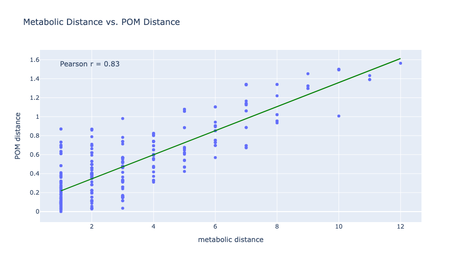
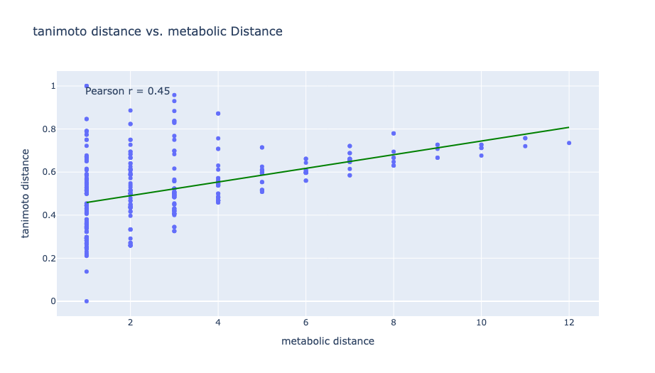
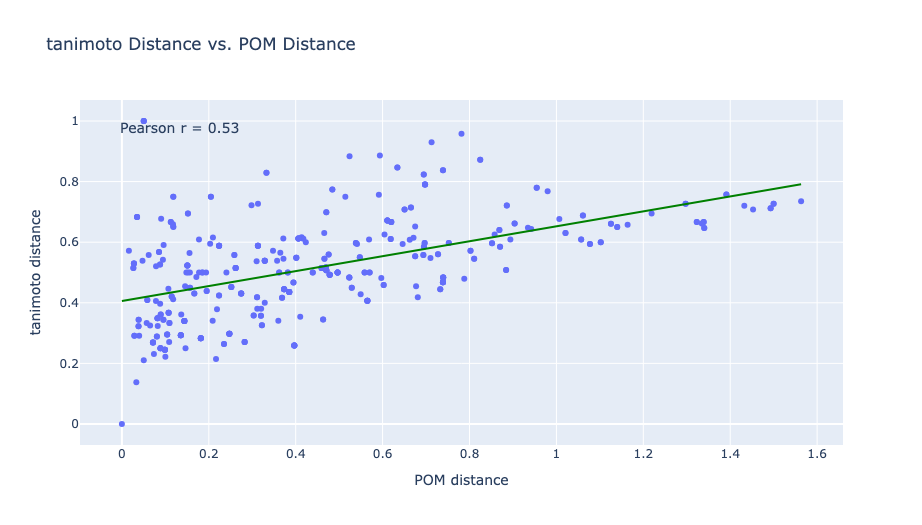

# Figures

This directory contains figures generated from:

`notebooks/pom_tanimoto_metabolic_correlations.ipynb`

---

## Metabolic Distance vs. POM Distance

This figure shows the relationship between metabolic distance and Principal Odor Map (POM) distance.

---

## Tanimoto Distance vs. Metabolic Distance

This figure shows the relationship between Tanimoto distance and metabolic distance.

---

## Tanimoto Distance vs. POM Distance

This figure shows the relationship between Tanimoto distance and POM distance.

---

## Data Source

The analysis uses metabolite pair data from:

- Qian et al. (2023)

and odor embeddings from:

- Lee et al. (2023) Principal Odor Map (POM)
